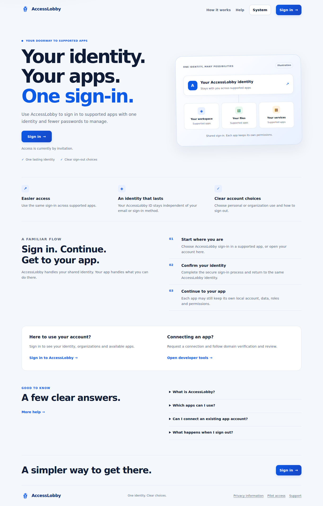
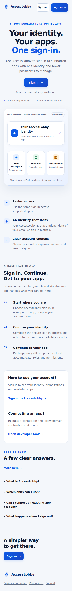
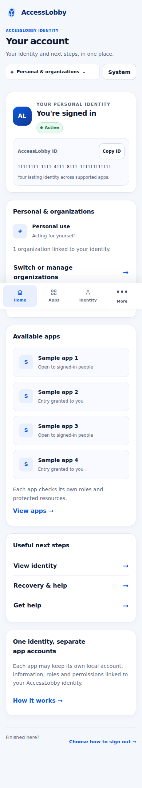
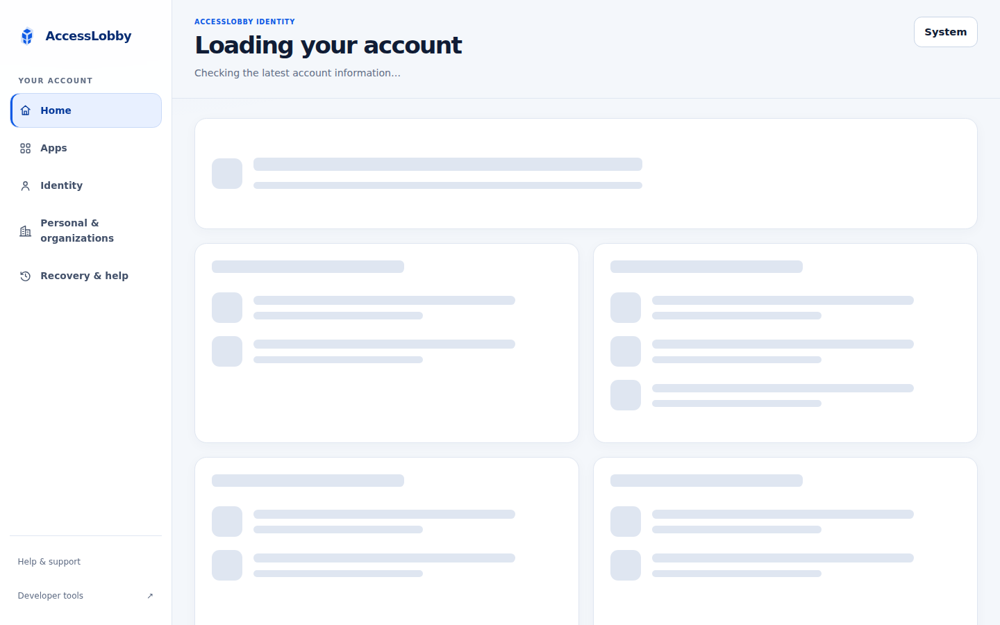

# AccessLobby UI refinement — 2026-10-02

Owner-requested implementation from current main `e0ddc8432de0db8fee17e01316ed22458961fea8`. This is presentation and interaction refinement. API contracts, person resolution, PKCE/state/nonce handling, native mutation endpoints, membership/admission/resource boundaries, session sealing, peer behavior and service-worker activation/cache policies remain unchanged. Native action redirects now show success feedback and application-management results land in `/apps/manage`. Old `/apps?notice=…` links continue there.

## Implemented scope

| Area | Result |
| --- | --- |
| Landing | Short value proposition, one primary action, session-aware account entry, truthful illustration, three benefits, how-it-works, distinct user/developer paths, FAQs and final action. Registration remains feature-gated. |
| Shared UI | Restrained tokens, readable hierarchy, fewer panels/status repetitions, responsive header/sidebar and four-item mobile navigation, account menu, help/privacy information and useful missing/error pages. Working destinations replace disabled future navigation. |
| Account/identity | Stable owner-visible and copyable ID, one confirmed identity status, live organization/invitation context, available apps, concise next steps. Unavailable profile/recovery controls use progressive disclosure. |
| Applications | Consumer cards with search when useful, grounded empty/error states, separate developer workspace. Request, DNS verification and entry-grant forms retain their actual POST fields and permission contracts. |
| Organizations/forms | Native validation plus linked error summaries and field descriptions, unsaved-change guards, progress, duplicate-submit prevention, confirmations with cancel/Escape/focus, success/error feedback. Existing authorization remains authoritative. |
| Loading | Route skeletons for account, identity, contexts, organization detail, apps, developer tools, recovery and sign-out; independent account organization/app section skeletons. No success or identity/access claim before validation. Reduced motion stops pulse animation. |
| Sign-out | Separate accessible choice page; unchanged current-app and shared current-browser POST scopes. Unavailable/restricted identities can still clear their local session. No claim of all-device logout. |
| Authentication appearance | Quieter bundled Keycloak CSS aligned with the account UI, mobile/focus/dark/reduced-motion support. Engine-owned templates, forms, credential handling and realm configuration remain unchanged. |
| PWA | Dismissible browser-supported install suggestion, truthful connection notice, existing safe offline/update behavior. New private sign-out route is no-store. Staging browser checks recognize the exact observed legacy/refined UI and include both new account routes when the refined release is deployed; the previously accepted Build B remains testable. |
| Page metadata | Public titles/descriptions, protected noindex metadata and privacy-preserving headers. |

Streamed account rendering requires JavaScript; a no-script notice explains this and hides inert loading placeholders. Native POST transport still works with client scripts disabled after the form has rendered.

No launch URL exists in the current visible-application contract, so app names do not masquerade as trusted launch buttons. Pilot privacy/access information describes current behavior; it does not invent approved legal terms, self-service recovery, consent/export/deletion APIs or public adoption metrics.

## Local verification

- Frozen-lockfile install, full typecheck and production build PASS. No dependency or lockfile change.
- Web tests: 21 PASS; consumer tests: 15 PASS; API tests: 11 PASS, 8 database-dependent tests NOT RUN locally. Those retain PostgreSQL in CI.
- Infrastructure Python: 44 PASS. Private-client scope/cleanup tests: 9 PASS. Production dependency audit: no known vulnerabilities.
- Production UI Chromium smoke PASS using the actual built web app, actual native POST handlers and a **loopback-only synthetic identity API**. It checks six widths (360/390/412/768/1366/1440), feature gates, all signed-out protected routes/no-store, delayed route/section loading, person-bound organization selection/membership recheck, app search/empty state, validation/disclosure/unsaved guard, named revoke submitter/duplicate prevention, role-dependent organization controls, keyboard menu/Escape/focus, 200% text resize, retry, both logout choices, native POSTs with client scripts disabled after rendering, cross-origin refusal and no hydration errors.
- Optional local axe-core scan: 22 scans (11 routes × light/dark), zero automated WCAG violations. This is an automated check, not a claim of comprehensive WCAG conformance.
- Existing production PWA smoke PASS: manifest/worker/offline, A→B update, critical/dirty/unresponsive peer windows, retry, no peer reload and preserved state.
- Existing Enben browser smoke PASS: save/edit/delete, two-account denial, no-store, outage/reconnect, current-app logout, six widths, keyboard focus and touch targets.
- Chromium was supplied by a temporary testing runtime because the standard browser download failed in this environment. No testing runtime was added to the repository dependencies. The agent-browser daemon could not start; production Playwright checks and direct screenshot review provided browser verification.
- `git diff --check` PASS. Auth routes/engine, API, consumer, worker and update-policy sources checked byte-for-byte unchanged against the starting main.

The new production UI smoke runs in existing CI and uploads an ephemeral screenshot/report artifact. Existing joined real IAM/PostgreSQL/peer regression and actual bundled-IAM-theme browser checks remain required before integration. Local fixtures do not prove real IAM or staging acceptance.

## Reviewed screenshots

Public desktop and mobile views are real rendered production pages. Account/loading images use the synthetic identity fixture; their IDs, membership and application examples are not live data.

## Remaining release evidence

CI and bundled-IAM-theme qualification are pending when this record is first written. No web/API/IAM image was deployed and no staging session, organization, app grant or registry row was changed. Exact-image staging/UI acceptance is a subsequent release step. Existing #44 onboarding and #52 installed-device/guard release gates remain open; this UI implementation does not close them.

## CI continuation

Source `f4047f8dcee31f3c1c6a7f61c89ff1cdb9d57d58`: real IAM/peer job `110933698853` in [CI 37035836864](https://github.com/WB-DevWorld/AccessLobby/actions/runs/37035836864) PASS, with all five app-onboarding phases and `ENBEN_REAL_IAM_PASS` at 16:44:59 UTC. [Bundled authentication theme 37035836976](https://github.com/WB-DevWorld/AccessLobby/actions/runs/37035836976) PASS. [Deployed public PWA check 37035836855](https://github.com/WB-DevWorld/AccessLobby/actions/runs/37035836855) PASS against its existing expected Build B; this does not prove deployment of the refined UI. The normal verification job passed PostgreSQL tests, typecheck/build, new UI smoke, existing PWA/Enben browser checks, source guards and container builds, then failed its secondary-network check because that check still searched for the old invitation wording. The assertion is corrected to the new invitation notice and both old/new account-creation labels are prohibited while registration is disabled. Full final-head CI remains pending at this continuation; no failed workflow is presented as an overall PASS.
